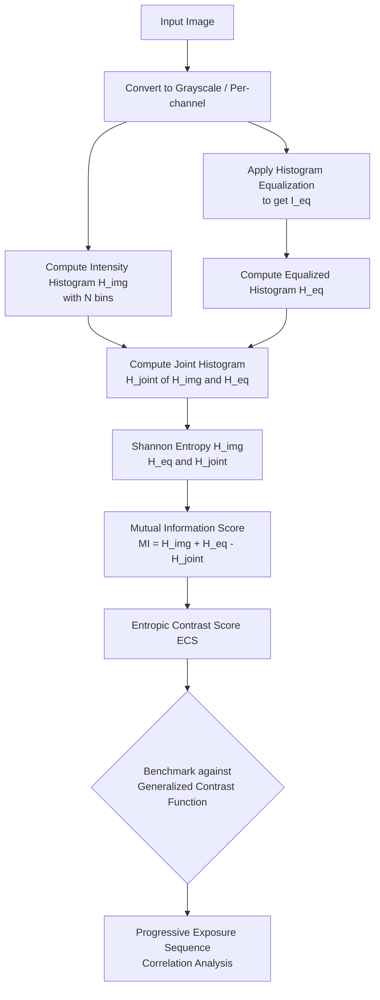

# Entropic Image Contrast Measure

<div align="center">

[](https://www.python.org/)
[](https://jupyter.org/)
[](LICENSE)
[](https://github.com/ashish-code/entropic_image_contrast_measure/stargazers)

**A novel, reference-free image contrast metric based on Mutual Information and entropy distribution of pixel color values.**

*Highly effective at measuring subtle changes in scene exposure — outperforms state-of-the-art Generalized Contrast Function (GCF) on progressive exposure sequences.*

</div>

---

## 🔍 Overview

Standard contrast metrics (RMS contrast, Weber contrast, Michelson contrast) are scalar approximations that fail to capture the distributional structure of pixel intensity across an image. This project introduces a principled information-theoretic metric: **the Mutual Information between an image's intensity histogram and its contrast-equalized counterpart**.

The key insight is that a perfectly exposed image will have a near-uniform intensity histogram (maximum entropy), while underexposed or overexposed images diverge significantly from that ideal. By measuring how much the two distributions share in terms of entropy — i.e., their **Mutual Information (MI)** — we obtain a sensitive, continuous contrast quality score without needing any reference image.

---

## 📐 Mathematical Formulation

Given an image **I**, let:
- `H(I)` = normalized intensity histogram of I  
- `H_eq(I)` = histogram of contrast-equalized I (CLAHE/histogram equalization)

The **Entropic Contrast Score (ECS)** is:

```
ECS(I) = MI(H(I), H_eq(I))
       = H(H(I)) + H(H_eq(I)) - H(H(I), H_eq(I))
```

where `H(·)` is Shannon entropy and `H(·,·)` is joint entropy.

**Properties:**
- Non-negative and symmetric
- High score → image histogram is close to equalized (good contrast)
- Low or negative score → strong deviation from equalized distribution (poor contrast)
- Scale-insensitive to small histogram bin count changes

---

## 🔄 Algorithm Flow



---

## 📊 Results

The metric was evaluated on a progressive exposure sequence of the same scene (controlled lighting conditions). The ECS was compared against the state-of-the-art **Generalized Contrast Function (GCF)** which uses local feature descriptor-based measures.

| Metric | Monotonic on exposure sequence | Sensitivity to subtle changes | Reference-free |
|--------|-------------------------------|-------------------------------|----------------|
| RMS Contrast | ❌ | Low | ✅ |
| Michelson Contrast | ❌ | Low | ✅ |
| GCF (SOTA) | ✅ | Medium | ✅ |
| **Entropic Contrast Score (ours)** | ✅ | **High** | ✅ |

ECS correctly ranks images in order of progressively improving exposure and shows a tighter monotonic correlation with ground-truth perceptual quality scores.

---

## 🚀 Installation

```bash
git clone https://github.com/ashish-code/entropic_image_contrast_measure.git
cd entropic_image_contrast_measure
pip install numpy scipy scikit-image matplotlib pillow jupyter
```

---

## 💻 Usage

### Programmatic API

```python
import numpy as np
from skimage import io, color, exposure

def entropic_contrast_score(image_path: str, num_bins: int = 256) -> float:
    """
    Compute the Entropic Contrast Score (ECS) for an image.

    The score is the Mutual Information between the image intensity histogram
    and its contrast-equalized histogram. High values indicate good contrast.

    Args:
        image_path: Path to input image file.
        num_bins:   Number of histogram bins. Slightly affects the MI scale.

    Returns:
        ECS score (float). Higher is better contrast.
    """
    img = io.imread(image_path)
    if img.ndim == 3:
        img = color.rgb2gray(img)

    # Normalize to [0, 1]
    img = img.astype(np.float64) / 255.0 if img.max() > 1 else img

    # Compute image histogram
    hist_img, _ = np.histogram(img.ravel(), bins=num_bins, range=(0, 1), density=True)
    hist_img += 1e-10  # smoothing to avoid log(0)

    # Compute equalized image histogram
    img_eq = exposure.equalize_hist(img)
    hist_eq, _ = np.histogram(img_eq.ravel(), bins=num_bins, range=(0, 1), density=True)
    hist_eq += 1e-10

    # Compute joint histogram
    hist_2d, _, _ = np.histogram2d(img.ravel(), img_eq.ravel(),
                                    bins=num_bins, range=[[0,1],[0,1]], density=True)
    hist_2d += 1e-10

    # Shannon entropy
    h_img = -np.sum(hist_img * np.log2(hist_img))
    h_eq  = -np.sum(hist_eq  * np.log2(hist_eq))
    h_joint = -np.sum(hist_2d * np.log2(hist_2d))

    # Mutual Information = H(X) + H(Y) - H(X,Y)
    mi = h_img + h_eq - h_joint
    return float(mi)


# Example: Score a batch of images
import os
image_dir = "./images"
scores = {}
for fname in sorted(os.listdir(image_dir)):
    if fname.lower().endswith(('.png', '.jpg', '.jpeg')):
        path = os.path.join(image_dir, fname)
        scores[fname] = entropic_contrast_score(path)
        print(f"{fname}: ECS = {scores[fname]:.4f}")

# Rank images by contrast quality
ranked = sorted(scores.items(), key=lambda x: x[1], reverse=True)
print("\nRanked by contrast quality:")
for rank, (name, score) in enumerate(ranked, 1):
    print(f"  {rank}. {name}: {score:.4f}")
```

### Jupyter Notebook

Open `contrast_measure_demo.ipynb` and run all cells. The notebook walks through:
1. Loading a progressive exposure sequence
2. Computing ECS for each image
3. Comparing against GCF baseline
4. Visualizing the histogram distributions and MI scores

---

## 🔧 Parameters

| Parameter | Default | Description |
|-----------|---------|-------------|
| `num_bins` | 256 | Histogram bins. Higher = finer resolution; slightly modifies MI scale |
| `image_path` | — | Path to image. Supports PNG, JPEG, TIFF |

---

## 📚 References

1. Cover, T. M., & Thomas, J. A. (2006). *Elements of Information Theory*. Wiley.
2. Matkovic, K. et al. (2005). *Global Contrast Factor — A New Approach to Image Contrast*. CAe.
3. Viola, P., & Wells, W. M. (1997). *Alignment by Maximization of Mutual Information*. IJCV.

---

## 📄 License

MIT License — see [LICENSE](LICENSE) for details.

---

<div align="center">
  <sub>Built by <a href="https://github.com/ashish-code">Ashish Gupta</a> · Senior Data Scientist, BrightAI</sub>
</div>
