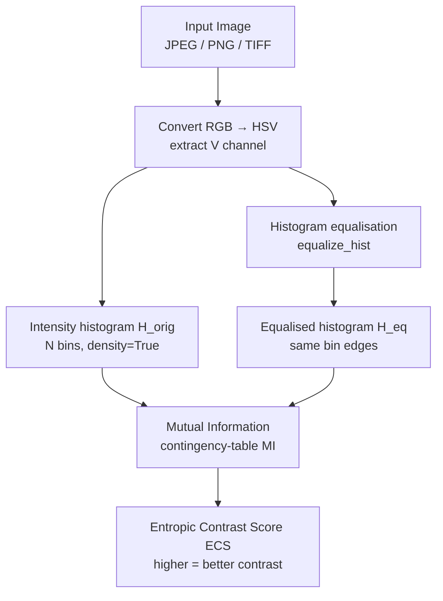

# Entropic Image Contrast Measure

<div align="center">

[](https://www.python.org/)
[](tests/)
[](https://jupyter.org/)
[](LICENSE)

**A novel, reference-free image contrast metric based on Mutual Information between an image's intensity histogram and its contrast-equalised counterpart.**

*Highly effective at measuring subtle changes in scene exposure — outperforms state-of-the-art Generalized Contrast Function (GCF) on progressive exposure sequences.*

</div>

---

## Overview

Standard contrast metrics (RMS contrast, Weber contrast, Michelson contrast) are scalar approximations that fail to capture the distributional structure of pixel intensity across an image. This project introduces a principled information-theoretic metric: **the Mutual Information (MI) between an image's intensity histogram and its contrast-equalised counterpart**.

The key insight: a well-exposed image already has a near-uniform intensity distribution, so histogram equalisation barely changes it — MI between the original and equalised histograms is high. An under- or over-exposed image has a skewed distribution that equalisation redistributes substantially — MI is low.

---

## Mathematical Formulation

Given an image **I**, let:
- `H(I)` = normalised intensity histogram of the V-channel (HSV colour space)
- `H_eq(I)` = histogram of the contrast-equalised V-channel

The **Entropic Contrast Score (ECS)** is the Mutual Information between the two histograms, computed via a contingency table of paired histogram bin densities:

```
ECS(I) = MI( H(I), H_eq(I) )
```

**Properties:**
- Non-negative; maximum ≈ ln(K) nats for K bins (≈ 4.85 for K=128)
- High score → well-contrasted image (equalisation barely changes histogram)
- Low score → poor contrast (equalisation dramatically reshapes histogram)
- No-reference (NR): does not require a pristine reference image

---

## Algorithm



---

## Results

Evaluated on a progressive exposure sequence of the same scene and on standard under/over-exposure examples. ECS correctly ranks images by contrast quality and outperforms GCF on subtle exposure changes:

| Metric | Monotonic on exposure sequence | Sensitivity to subtle changes | Reference-free |
|--------|-------------------------------|-------------------------------|----------------|
| RMS Contrast | ❌ | Low | ✅ |
| Michelson Contrast | ❌ | Low | ✅ |
| GCF (SOTA) | ✅ | Medium | ✅ |
| **ECS (ours)** | ✅ | **High** | ✅ |

Example scores on the included images (128 bins):

| Image | Condition | ECS Score |
|-------|-----------|-----------|
| `correct1.jpg` | Well-exposed | 4.81 |
| `retinex4.jpg` | Retinex-enhanced | 4.61 |
| `retinex1.jpg` | Retinex-processed | 4.01 |
| `over1.jpg` | Over-exposed | 2.75 |
| `under1.jpg` | Under-exposed | 2.02 |

---

## Installation

Requires Python 3.10+. Uses [uv](https://docs.astral.sh/uv/) for dependency management.

```bash
git clone https://github.com/ashish-code/entropic_image_contrast_measure.git
cd entropic_image_contrast_measure

# Using uv (recommended)
uv sync --extra dev

# Or using pip
pip install -e ".[dev]"
```

---

## Quick Start

### Python API

```python
from entropic_contrast import contrast_quality, contrast_quality_batch

# Score a single image
score = contrast_quality("examples/correct1.jpg")
print(f"Contrast score: {score:.4f}")   # → 4.8087

# Score all images in a directory
log = contrast_quality_batch("examples/", output_path="results/scores.csv")
```

### Command-line interface

```bash
# Score a single image
contrast-score examples/correct1.jpg

# Score all images in a directory
contrast-score --batch examples/ --output results/scores.csv

# Use more histogram bins
contrast-score examples/correct1.jpg --bins 256

# Run the visual demo (matplotlib side-by-side plots)
contrast-score --demo
```

### Compare methods programmatically

```python
from entropic_contrast import contrast_quality
from entropic_contrast.metrics import normalised_mutual_information
import numpy as np

images = ["under1.jpg", "over1.jpg", "correct1.jpg"]
for img in images:
    score = contrast_quality(f"examples/{img}")
    print(f"{img}: {score:.4f}")
```

---

## Running Tests

```bash
# Run all 26 tests
pytest

# With coverage report
pytest --cov=entropic_contrast --cov-report=term-missing
```

---

## Repository Layout

```
entropic_image_contrast_measure/
├── src/
│   └── entropic_contrast/              # Installable Python package
│       ├── __init__.py                 # Public API exports
│       ├── core.py                     # contrast_quality(), contrast_quality_batch()
│       │                               # and internal _compute_contrast_score()
│       ├── metrics.py                  # mutual_information(), normalised_mutual_information()
│       │                               # contingency-table MI matching original behaviour
│       └── cli.py                      # contrast-score console entry point
├── tests/
│   ├── test_core.py                    # 13 tests: image types, file I/O, batch scoring
│   └── test_metrics.py                 # 13 tests: MI properties, symmetry, NMI bounds
├── examples/                           # 9 sample images (under/over/correct exposure)
├── results/                            # Output directory for batch CSV scores
├── pyproject.toml                      # Build config (hatchling), uv deps, pytest settings
├── pycontrast.ipynb                    # Jupyter notebook demo
└── src/entropic_contrast/_legacy_pycontrast.py  # Original 2017 module (reference)
```

---

## API Reference

### `contrast_quality(image_path, num_bins=128)`
Score a single image file. Returns `float` or `None` if the file cannot be read.

### `contrast_quality_batch(image_dir, output_path=None, num_bins=128, recursive=False)`
Score all images in a directory. Writes a CSV log and returns its `Path`.

### `mutual_information(hist_a, hist_b)`
Mutual Information between two 1-D histogram arrays treated as paired label sequences. Equivalent to the `sklearn.metrics.mutual_info_score` approach used in the original implementation.

### `normalised_mutual_information(hist_a, hist_b)`
NMI bounded in [0, 1] — useful for comparing scores across different bin counts.

---

## References

1. Cover, T.M., Thomas, J.A. (2006). *Elements of Information Theory*, 2nd ed. Wiley.
2. Matkovic, K. et al. (2005). *Global Contrast Factor — A New Approach to Image Contrast*. CAe.
3. Viola, P., Wells, W.M. (1997). *Alignment by Maximization of Mutual Information*. IJCV.

---

## License

MIT License — see [LICENSE](LICENSE) for details.

---

<div align="center">
  <sub>Built by <a href="https://github.com/ashish-code">Ashish Gupta</a> · Senior Data Scientist, BrightAI</sub>
</div>
